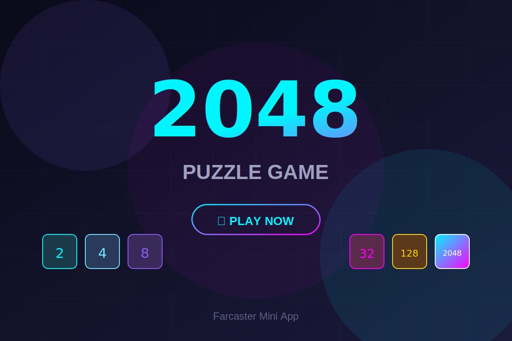

# 🎮 2048 Game - Farcaster Mini App

A beautiful cyberpunk-themed 2048 puzzle game built as a Farcaster Mini App.



## Features

- 🎨 Stunning cyberpunk/neon visual design
- 📱 Fully responsive (desktop & mobile)
- 👆 Touch/swipe controls for mobile
- ⌨️ Keyboard controls (Arrow keys or WASD)
- 💾 Local high score persistence
- ⚡ Smooth animations
- 🔮 Farcaster SDK integration

## Quick Start

```bash
# Install dependencies
npm install

# Run development server
npm run dev

# Build for production
npm run build
```

## Deployment

See [PANDUAN-LENGKAP.md](PANDUAN-LENGKAP.md) for complete deployment guide in Indonesian.

### Quick Deploy to Vercel

[](https://vercel.com/new/clone?repository-url=https://github.com/YOUR_USERNAME/farcaster-2048)

## Farcaster Integration

1. Enable Developer Mode in Farcaster
2. Generate manifest signature using Mini App Manifest Tool
3. Update `public/.well-known/farcaster.json` with your signature
4. Update URLs in `src/app/layout.tsx`

## Tech Stack

- **Framework**: Next.js 14
- **Language**: TypeScript
- **Styling**: CSS with custom properties
- **SDK**: @farcaster/miniapp-sdk

## File Structure

```
├── public/
│   ├── .well-known/
│   │   └── farcaster.json    # Farcaster manifest
│   ├── icon.svg              # App icon
│   ├── splash.svg            # Splash screen
│   └── og-image.svg          # Social share image
├── src/
│   └── app/
│       ├── globals.css       # Styling
│       ├── layout.tsx        # Layout + meta tags
│       └── page.tsx          # Game logic
└── package.json
```

## Controls

| Platform | Controls |
|----------|----------|
| Desktop | Arrow keys or WASD |
| Mobile | Swipe in any direction |

## License

MIT

## Author

Built with ❤️ for Farcaster
